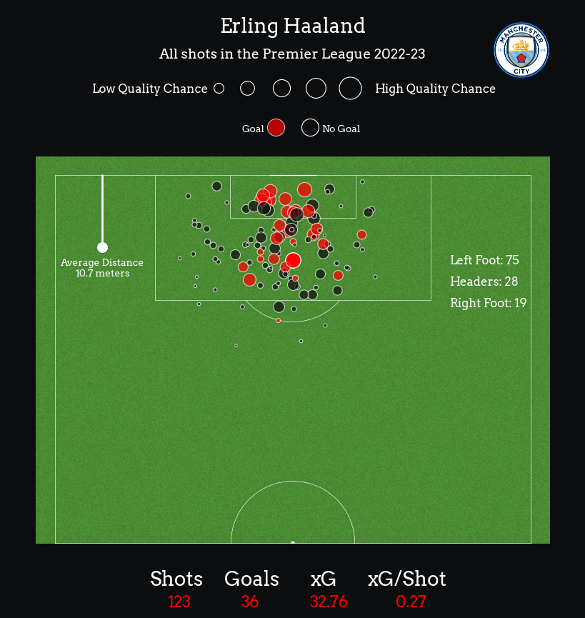

# Erling Haaland 2022 Shot Data

## Project Overview
This repository contains a dataset of Erling Haaland's shot attempts during the 2022 football season. Each row in the dataset corresponds to an individual shot, detailing information such as the timing, location, and outcome of the shot. This dataset is particularly useful for analyzing Haaland's shooting performance and understanding the context behind his shots.

## Dataset Description

The dataset includes the following attributes:

- **id**: Unique identifier for each shot attempt.
- **minute**: The minute of the match when the shot occurred.
- **result**: The outcome of the shot (e.g., Goal, MissedShots, BlockedShot).
- **X**: X-coordinate on the pitch where the shot was taken (fraction of the field's width).
- **Y**: Y-coordinate on the pitch where the shot was taken (fraction of the field's height).
- **xG**: Expected Goals (xG) value, representing the likelihood of the shot resulting in a goal.
- **player**: Name of the player who attempted the shot (Erling Haaland).
- **h_a**: Indicates whether the shot occurred during a home ('h') or away ('a') game.
- **player_id**: Unique identifier for the player.
- **situation**: The play situation during which the shot was taken (e.g., OpenPlay, Penalty).
- **season**: The season in which the match took place.
- **shotType**: The body part used for the shot (e.g., LeftFoot, RightFoot, Head).
- **match_id**: Unique identifier for the match.
- **h_team**: Home team in the match.
- **a_team**: Away team in the match.
- **h_goals**: Number of goals scored by the home team.
- **a_goals**: Number of goals scored by the away team.
- **date**: The date and time of the match.
- **player_assisted**: Name of the player who provided the assist, if applicable.
- **lastAction**: The final action before the shot (e.g., Pass, Cross, Throughball).

## Usage

This dataset is ideal for performance analysis, football statistics projects, and understanding Erling Haaland's shooting patterns. You can use it to perform analysis such as:

- Shot distribution on the pitch
- Expected goals (xG) analysis
- Performance comparison in home vs away games
- Play situation impact on shot outcomes

## Shot Map: Erling Haaland's 2022-23 Premier League Shots

This visualization showcases all of **Erling Haaland's shots** during the 2022-23 Premier League season, providing insight into his **shooting performance**:

- **123 shots** resulting in **36 goals**.
- **Expected goals (xG)**: 32.76, with an **xG per shot** of 0.27.
- **Average shot distance**: 10.7 meters, indicating most shots were from inside the penalty box.
- **Shot breakdown**: 
  - **Left foot**: 75 shots
  - **Headers**: 28 shots
  - **Right foot**: 19 shots
- **Shot outcomes**:
  - **Red circles**: Goals
  - **Black circles**: Missed/Blocked shots

This map highlights Haaland’s efficiency as a striker, with most shots taken in high-quality areas near the goal.

## Teams That Received the Most Goals from Erling Haaland (2022 Season)

This bar chart shows the **teams that received the most goals** from Erling Haaland during the 2022 Premier League season:

- **Wolverhampton Wanderers** and **Crystal Palace** are at the top, with Haaland scoring 4 goals against each.
- **Nottingham Forest**, **Manchester United**, **West Ham**, and **Southampton** each conceded 3 goals from Haaland.
- Several other teams, including **Fulham**, **Leicester**, **Brighton**, and **Arsenal**, conceded 2 goals.
- **Aston Villa**, **Tottenham**, and **Newcastle United** saw 1 goal each.

This chart highlights Haaland’s top performances against specific Premier League opponents during the 2022 season.

## Number of Assists by Player

This bar chart shows the **number of assists** provided by various Manchester City players during the 2022-23 Premier League season:

- **Kevin De Bruyne** leads with 25 assists.
- Other key contributors include **Phil Foden**, **Jack Grealish**, and **Riyad Mahrez**, each with more than 10 assists.
- The chart shows a gradual decrease in assists among other players such as **Ilkay Gündogan**, **Bernardo Silva**, and **Rodri**.
- Some defensive players and substitutes like **Nathan Aké**, **John Stones**, and **Rúben Dias** also made notable contributions.

This visualization highlights the distribution of assists across the team, with a clear lead from attacking midfielders and forwards.

## License

This project is licensed under the MIT License - see the [LICENSE](LICENSE) file for details.

## Acknowledgements

Data source: [Understat](https://understat.com) – a platform providing detailed football statistics.  
Special thanks to [mckayjohns](https://github.com/mckayjohns) for compiling and sharing and explaining his code.
